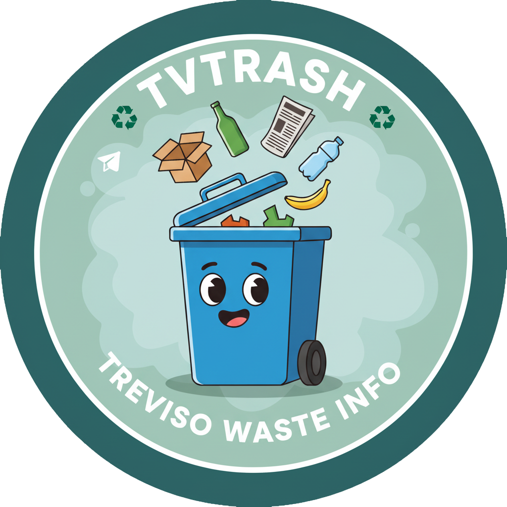

<p align="center">
  
</p>

# TVTrash Frontend

**TVTrash** is a webapp designed for residents of **Treviso, Italy**. It provides an intuitive interface to discover the official waste collection calendar from the local waste management company, helping you stay organized and eco-friendly.

**Key Features:**
- 📅 **Waste Collection Calendar:** Instantly check which waste types will be collected on any given day.
- 🔔 **Telegram Notifications:** Configure reminders to get notified the day before collection, so you never miss a pickup.
- 🌍 **Local Focus:** Tailored for Treviso city, with accurate, up-to-date data.

---

## 🚀 Quick Start

Clone the repo and install dependencies:

```bash
git clone https://github.com/yourusername/TVTrash.git
cd TVTrash/frontend
npm install # or pnpm install or yarn install
```

Start the development server:

```bash
npm run dev
```

Open [http://localhost:3000](http://localhost:3000) to view the app.

---

## 📦 Scripts

- **`npm run dev`** – Start development server
- **`npm run build`** – Build for production
- **`npm start`** – Alias for dev

---

## 🌐 Deployment

Build your app:

```bash
npm run build
```

Deploy the contents of the `dist` folder to any static host (Netlify, Vercel, Surge, etc.).

---

## 🤝 Community & Resources

- [SolidJS Documentation](https://solidjs.com)
- [Discord Community](https://discord.com/invite/solidjs)

---

## 🛠️ Tech Stack

- **SolidJS** – Reactive UI library
- **pnpm** – Fast, disk-efficient package manager

---

## 🏗️ Project Structure

```
frontend/
├── public/
│   └── favicon.png
├── src/
│   └── ...
├── package.json
└── README.md
```

---

## ✨ Credits

Created with [Solid CLI](https://github.com/solidjs-community/solid-cli).

---

<p align="center">
  
</p>